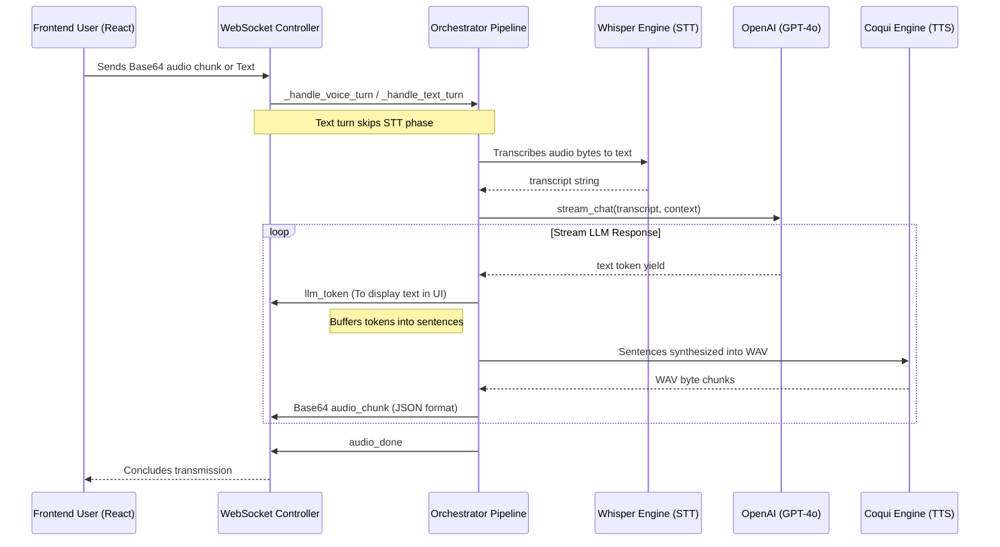

# 🎙️ VoiceGPT Project Architecture & State Guide

This document is designed to act as a **"System Prompt" or "Cheat Sheet"** for any AI. If you want an AI to continue developing or debugging this repository, paste this document into its context.

---

## 🎯 High-Level Overview
**VoiceGPT** is a production-grade, low-latency Voice AI Agent.
*   **Frontend**: React + Vite + Vanilla CSS (Glassmorphism design style).
*   **Backend**: Python FastAPI (orchestrator for STT, LLM, TTS).
*   **Data & State**: SQLite (Auth/Chat Logs), FAISS (Semantic Vector Memory), FakeRedis / Redis (Conversation session memory).
*   **Communication**: Bidirectional WebSockets.

---

## 🏗️ Architecture & Processing Pipeline (Mermaid Graph)
When a user interacts, the WebSocket flow goes through an Orchestrator Pipeline (`app.services.orchestrator.pipeline.VoicePipeline`).



---

## 📁 Directory Structure
```text
voicegpt/
├── backend/
│   ├── app/
│   │   ├── api/v1/         # FastAPI Routes (Auth, Chats, Voice)
│   │   ├── websockets/     # voice_socket.py (WS Handler)
│   │   ├── services/
│   │   │   ├── llm/        # gpt_client.py (OpenAI execution & mocking)
│   │   │   ├── stt/        # whisper_engine.py (Mocked due to ML size)
│   │   │   ├── tts/        # coqui_engine.py (Mocked due to ML size)
│   │   │   └── orchestrator/ # pipeline.py (Glues STT -> LLM -> TTS)
│   │   ├── db/             # SQLAlchemy / SQLite configs
│   │   └── memory/         # redis_client.py and vector_db.py (FAISS)
│   ├── .env                # Variables (DB configs, OpeNAI Key, etc.)
│   └── requirements.txt    # Python deps
├── frontend/
│   ├── src/
│   │   ├── hooks/          # useSocket.js (Core hook dealing w/ Web Audio API)
│   │   ├── store/          # Zustand global stores (auth, voice)
│   │   ├── components/     # Modals, ChatBubbles, Navbars
│   │   └── pages/          # App, Register, Login
│   └── vite.config.js
└── infra/                  # Docker and K8s configuration templates
```

---

## 🪛 Current Local Development Overrides
Due to local system constraints (Windows environment, missing GPU packages, avoiding 4GB+ parameter models), several production targets have been **temporarily mocked/overriden**:

1. **Databases**: 
   * `PostgreSQL` was swapped for `SQLite` (`aiosqlite`) under `app/core/config.py`.
   * `Redis` was swapped for a python memory-dict via the `fakeredis` library.
2. **STT (Whisper)**: 
   * Bypassed. `whisper_engine.py` is mocked to immediately yield a hardcoded transcript: *"Hello, I am using a mock voice because I am running locally without heavy dependencies."*
3. **TTS (Coqui Neural)**: 
   * Bypassed. `coqui_engine.py` generates an empty silent buffer frame (array of zeros) rather than real speech.
   * **Frontend Fallback**: The frontend (`useSocket.js`) checks if the audio bytes are silent. If true, it falls back to the native browser `window.speechSynthesis` engine to vocalize the `llm_token` responses.

---

## 🛠️ Typical "Where do I edit..."
*   **"I want to add real cloud Voice Recognition (like Groq/AssemblyAI instead of Whisper)"**: Edit `backend/app/services/stt/whisper_engine.py`. Replace the mock logic with an async HTTP request to a cloud API.
*    **"The frontend audio won't play"**: Edit `frontend/src/hooks/useSocket.js` and trace the `audio_chunk` WS event Base64 decoder.
*   **"We want to change the LLM Prompt / Engine"**: Edit `backend/app/services/llm/gpt_client.py` where `SYSTEM_PROMPTS` and the AsyncOpenAI streaming execution are stored.
